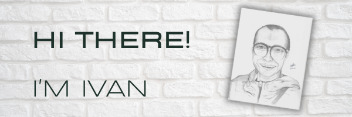

[](https://www.linkedin.com/in/fivan/)
[](https://twitter.com/fivanunam)

# 
```console
     Looking for: Front-End Developer roles
     Main Stack: React & Redux, Sass
     Previous experience: Full-stack Developer with ASP.NET framework (MVC, REST API)
     Languages: Javascript, HTML, CSS, C#
     Fun facts: Calisthenics practitioner
```
<div style="display: flex; flex-direction: column; justify-content: center; align-items: center;">
     <a href="https://github.com/fivan18/github-readme-stats">
          
     </a>
     <!-- 
     <a href="https://github.com/fivan18/github-readme-stats">
          
     </a>
     -->
</div>


<!--
**fivan18/fivan18** is a ✨ _special_ ✨ repository because its `README.md` (this file) appears on your GitHub profile.

Here are some ideas to get you started:

- 🔭 I’m currently working on ...
- 🌱 I’m currently learning ...
- 👯 I’m looking to collaborate on ...
- 🤔 I’m looking for help with ...
- 💬 Ask me about ...
- 📫 How to reach me: ...
- 😄 Pronouns: ...
- ⚡ Fun fact: ...
-->
